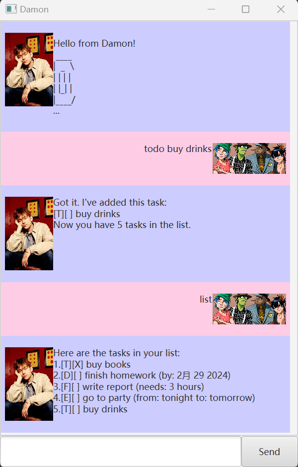

# Damon User Guide




## <code style="color : Orange">Feature 1 - Add a new Task</code>

- Add a new Task to current TaskList.
- Command:
  - Command to add ToDo Task: todo {description}
  - Command to add Deadline Task: deadline {description} /by {due date}
    *due date should be in yyyy-mm-dd format*
  - Command to add Event Task: event {description} /from {starttime} /to {endtime)
  - Command to add FixedDuration Task: fixedduration {description} /needs {duration}


## <code style="color : Orange">Feature 2 - Delete a Task</code>

- Delete the Task of given index
- Command: delete {Task index}


## <code style="color : Orange">Feature 3 - Mark a Task as done</code>

- Mark the Task of given index as done
- Command: mark {Task index}


## <code style="color : Orange">Feature 4 - Unmark a Task to not done</code>


- Unmark the Task of given index to not done
- Command: unmark {Task index}


## <code style="color : Orange">Feature 5 - Find Task by keyword</code>

- Find Tasks including given keywords in description
- Command: find {keyword}


## <code style="color : Orange">Feature 6 - Exit Damon</code>

- Say Goodbye to Damon!
- Command: bye


## <code style="color : Orange">Feature 7 - Save TaskList to hard disk</code>

- Damon will automatically save TaskList in "Damon.txt" file and update the file once you change the TaskList. You may change the storage path in **iP\src\main\java\damon\gui\Main.java**, i.e.,
```java
private Damon damon = new Damon("put your storage path here!");
```